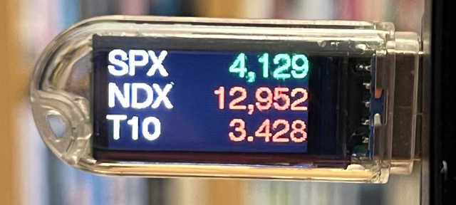
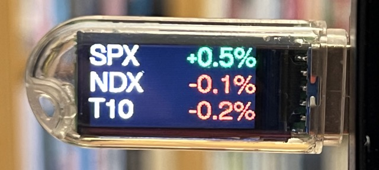

# Stock Market Display using the LilyGO T-Dongle-S3

## What is this?

This program displays stock market information on a [LilyGO T-Dongle-S3](https://github.com/Xinyuan-LilyGO/T-Dongle-S3). Market information corresponds to three tickers:

* S&P500 (SPX)
* NASDAQ100 (NDX)
* T-Bill 10 year (T10)

The display cycles between the current market value:

And the percentage of change from the previous day.

The information is read from Yahoo Finance. Thus, the ESP32 needs to have access to the internet. The board automatically creates a wireless access point called "T-Dongle-S3". For configuring access to the
internet you need to fist connect to this AP and then go to http://192.168.4.1. There you can save
the wireless credentials to future accesses. You only need to do this once.

Debug information is always provided on the serial port.

## How to compile and run

Requirements:

* Make sure that you have [Visual Studio Code](https://code.visualstudio.com) installed
* Make sure that you have [Platform IO](https://platformio.org) installed
* Make sure you have [Espressif IDF](https://github.com/espressif/vscode-esp-idf-extension) extension installed

If you have all these installed, simply open the project in PlatformIO, hit the "build" and "upload" buttons. See the notes above about configuring the wireless credentials. You can also refer to [ESP_WifiManager](https://github.com/khoih-prog/ESP_WiFiManager).
